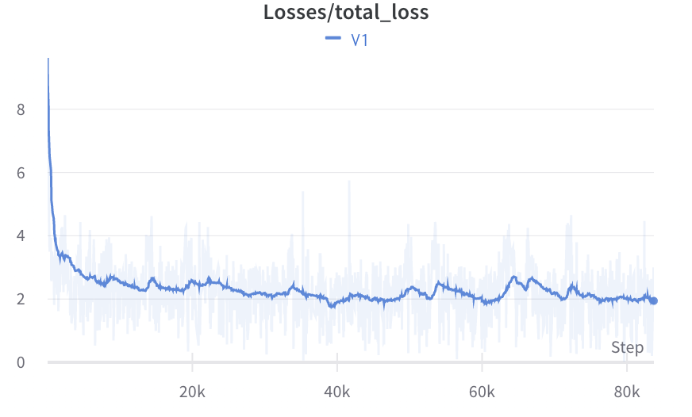

<!--
 * @Author: LiangSong(sl12160010@gmail.com)
 * @Date: 2023-03-10 21:18:35
 * @LastEditors: LiangSong(sl12160010@gmail.com)
 * @LastEditTime: 2023-05-08 22:28:51
 * @FilePath: /Open-Llama/README.md
 * @Description: 
 * 
 * Copyright (c) 2023 by LiangSong(sl12160010@gmail.com), All Rights Reserved. 
-->
[**中文**](./README_zh.md) | [**English**](./README.md)

# Open-Llama

<p align="center">
    
    
    
    
</p>

Open-Llama is an open-source project that offers a complete training pipeline for building large language models, ranging from dataset preparation to tokenization, pre-training, prompt tuning, lora, and the reinforcement learning technique RLHF.

**You can try this model directly from the [Demo](http://home.ustc.edu.cn/~sl9292/).**

## **Main contents**

- **Support Transformers/HuggingFace.** The CheckPoint after Instruct-tuning is open-source on [HuggingFace: s-JoL/Open-Llama-V1](https://huggingface.co/s-JoL/Open-Llama-V1).

- **By adopting the same evaluation method as the FastChat project, Open-Llama's performance is compared to GPT3.5’s. After testing, it can reach 84% of GPT3.5's performance on Chinese questions.**

- **The training speed reaches 3620 tokens/s, faster than the 3370 tokens/s reported in the original Llama paper, reaching the current state-of-the-art level.**

 To use the CheckPoint, first, install the latest version of Transformers with the following command:
``` python
pip install git+https://github.com/huggingface/transformers.git

from transformers import AutoModelForCausalLM, AutoTokenizer

tokenizer = AutoTokenizer.from_pretrained("s-JoL/Open-Llama-V1", use_fast=False)
model = AutoModelForCausalLM.from_pretrained("s-JoL/Open-Llama-V1").cuda()

inputs = tokenizer('user:implement quick sort in python\nsystem:', return_tensors='pt', return_attention_mask=False)
for k, v in inputs.items():
   inputs[k] = v.cuda()
pred = model.generate(**inputs, max_new_tokens=512, do_sample=True)
print(tokenizer.decode(pred.cpu()[0], skip_special_tokens=True))

```
The CheckPoint after pre-training only is also uploaded to [s-JoL/Open-Llama-V1-pretrain](https://huggingface.co/s-JoL/Open-Llama-V1-pretrain).
The model [PR](https://github.com/huggingface/transformers/pull/22795) has been submitted for merging into the Transformers main branch.

We have completed 300B token pre-training, training a total of 80 K steps. The Global Batch Size is consistent with Llama at 4M.
Using a total of 7 parts of data to constitute the Instruction-tuning data, the model has certain programming abilities, mathematical abilities, and multi-turn dialogue abilities. Specific data can be found in the Instruction-Tuning section.

Below is a display of the model's multi-turn dialogue ability regarding code:


## **Updates**

**[2023.5.8] Release v2.1**

- This update adds support for larger model training. Using DeepSpeed stage3 + offload + activation checkpoint, you can **train a 65B model on a single machine with 8 A100-80G**. 

- The peft library is introduced to **support training such as lora**.

- The following table compares the training speed of Open-Llama and the original Llama, and the performance data of Llama is quoted from the original Llama paper.


|                | DeepSpeed Stage | Offload | Activation Checkpoint | Total Token | GPU hours | Speed token/s/gpu | Batch Size | CPU Memory |
|----------------|-----------------|---------|-----------------------|-------------|-----------|-------------------|------------|------------|
| Open-Llama 7B  | 1               | False   | False                 | 173.7B      | 13412     | 3587              | 2          | 94G        |
| Open-Llama 13B | 3               | False   | True                  | -           | -         | 1616              | 24         | 100G       |
| Open-Llama 33B | 3               | False   | True                  | -           | -         | 708               | 12         | 100G        |
| Open-Llama 65B | 3               | True    | True                  | -           | -         | 369               | 12         | 440G       |
| Llama 7B       | -               | -       | -                     | 1T          | 82432     | 3370              | -          | -          |
| Llama 13B      | -               | -       | -                     | 1T          | 135168    | 2055              | -          | -          |
| Llama 33B      | -               | -       | -                     | 1.4T        | 530432    | 733               | -          | -          |
| Llama 65B      | -               | -       | -                     | 1.4T        | 1022362   | 380               | -          | -          |

**[2023.4.28] Release v2.0**

This update mainly includes the following aspects, increasing the effective training speed by **50%** compared to the v1 version, reducing padding from **30%** to **5%**, and improving training speed from **3200 tokens/s** to **3587 tokens/s**. 0.95 * 3587 / (0.7 * 3200) = 1.521

1. Use HuggingFace's datasets library for data reading, with the process as follows:
   1. Use the transform function to unify data formats from different datasets to {'text': 'xxx'}
   2. Tokenize using Tokenizer
   3. Sample long sequences; currently, three modes are provided: truncation, sampling (refer to the [Gopher paper](https://arxiv.org/abs/2112.11446)), and splitting
   4. Optional: concatenate texts from different docs, reducing padding in the data and accelerating training. In the v1 version, padding accounted for **30%**; after concatenation, padding is reduced to **5%**.
2. Add Trainer, which can be reused for both pre-training and instruction fine-tuning, see solver/trainer.py
3. Unify the pre-training and instruction fine-tuning training entry to train_lm.py
4. Provide more convenient configuration, see configs/pretrain_config.yaml
5. Provide functionality to continue pre-training based on other pre-trained models and supplementing vocabulary
6. Resuming training from a checkpoint is supported, including loading optimizer parameters/learning rate and skipping duplicate data

[2023.4.16] Release v1.0

Basic pre-training and instruction fine-tuning codes are provided, with a training speed comparable to that of the original Llama. The pre-trained and fine-tuned models are already open-sourced on HuggingFace.

v1 version code can be seen at https://github.com/s-JoL/Open-Llama/tree/v1.0

## **Features**

### Easy to use

We believe that ease of use is one of the most important features when building large language models. To make Open-LLAMA more accessible, we have focused on the following aspects:

- **Minimal implementation**: We have adopted the simplest implementation methods, lowering the entry threshold and allowing beginners to get started with ease.
- **Complete pipeline**: We have published the complete code from dataset construction to training, making every step in the process of building a large language model clear and visible.

### High performance

Due to the high cost of training large language models, high performance is also crucial when building them. To achieve high-performance training, we have employed the following techniques:

- **Fused CUDA kernel**: Using the fused CUDA kernel provided in [xformers](https://github.com/facebookresearch/xformers) can fuse multiple operations, reducing data transfer between the GPU and CPU, thereby improving training efficiency.
- **Parallelized training**: We employ the [Accelerate](https://huggingface.co/docs/accelerate/index) library to support parallelized training on multiple GPUs to speed up the training process.

For a 7B model, the training speed with the native PyTorch Llama model in Transformers is **1378 tokens/s/GPU**. Using this codebase, the training speed reaches **3626 tokens/s/GPU**, exceeding **3370 tokens/s/GPU** reported in the [original Llama paper](https://arxiv.org/pdf/2302.13971.pdf).

If pre-training with 500B tokens, 38300 GPU hours are required. According to the hourly price for 8 A100-80G Spot GPUs on Google Cloud, which is 12.6 US dollars, the total cost is 60,300 US dollars.
When using the unaccelerated version for training, the cost is 158,744 US dollars. The final training cost is reduced by 98,000 US dollars.

For more testing, see [performance comparison with other open-source models](https://github.com/Bayes-Song/Open-Llama#%E5%92%8C%E5%85%B6%E4%BB%96%E5%BC%80%E6%BA%90%E6%A8%A1%E5%9E%8B%E6%80%A7%E8%83%BD%E5%AF%B9%E6%AF%94).

### Versatility

When training language models, our goal is to build a versatile model that can handle different languages and domains. To achieve this, we have employed the following strategies:

- **Multi-language support**: We support multiple language corpora, including English, Chinese, Japanese, and many other languages, allowing users to choose according to their requirements.
- **Domain versatility**: We hope that the model can not only help with everyday questions but also assist in professional domains such as science, law, etc.
- **Interaction with the world**: By incorporating reinforcement learning (RL), we hope to give the model the ability to interact with the world.

## **Requirements**

- Python 3.7 or higher
- PyTorch 1.13
- Special version of [Transformers library](https://github.com/Bayes-Song/transformers)
- [Accelerate library](https://huggingface.co/docs/accelerate/index)
- CUDA 11.6 or higher (for GPU acceleration)
- Hardware configuration: currently using (64 CPU, 1000G Memory, 8xA100-80G) x N. There is a rather curious phenomenon that when more CPUs are used, the system runs slightly slower. I speculate this may have something to do with the multi-processing of dataloader.

## **Getting Started**
### Installation

Use the following command to install related dependencies:

```bash
pip install -r requirements.txt
```

### Dataset Preparation

Currently provided are the Wudao dataset open-sourced by Zhiyuan and the Pile dataset open-sourced by EleutherAI. Dataset download and processing scripts are located in the data directory.
Due to the required agreement for downloading the Wudao dataset, you may need to modify the link in download_wudao. [Wudao](https://data.baai.ac.cn/details/WuDaoCorporaText).

**Note that data download may fail. It is recommended to divide the download and processing in the script into two parts for multiple attempts, which will automatically resume downloads from breakpoints.**

Run the following commands to download the data and perform partitioning:
```bash
bash data/download_the_pile.sh
bash data/download_wudao.sh
```
The data will be stored as small files, with a maximum of 16384 lines per file, for easy reading during multi-process training. The storage format is jsonl.zst, compressed using zstd, with a final data size of 519.5 GB, consisting of 16,466 files in total.

The Pile dataset contains 210,607,728 JSON lines, while the Wudao dataset contains 59,132,213 JSON lines.

The specific data format is as follows:
```
WuDao
{'id': 1, 'dataType': '百科', 'title': 'some title', 'content': 'some content'}

The Pile
{'text': 'some text', 'meta': {'pile_set_name': 'Github'}}
```
Check the data integrity in [issue](https://github.com/s-JoL/Open-Llama/issues/5).

### Related Tools

In the utils directory, training tokenizer/supplementing existing tokenizer models and conversion checkpoint code are provided.

Use SentencePiece to train a tokenizer with the following command:

```bash
python3 utils/train_tokenizer.py
```

In configs, a tokenizer model with a 40k vocabulary, trained only using the Wudao dataset (4w_cn_vocab_wudao15.model), is provided.

To supplement the vocabulary based on an existing tokenizer model, refer to:

```bash
python3 utils/merge_tokenizer.py
```

A bilingual English and Chinese tokenizer model (llama_tokenizer_extended.model) is created by merging the META official tokenizer model with the 40k Chinese tokenizer mentioned above.

To convert existing Llama model checkpoints, refer to:

```bash
python3 utils/convert_ckpt.py
```

### Data Loading

Data loading-related code can be found in dataset/dataset.py, which includes pre-training and instruction fine-tuning data processing. To add other datasets, only the transform function needs to be modified.

The data loading process is as follows:

1. Use the transform function to unify data formats from different datasets to {'text': 'xxx'}
2. Tokenize using Tokenizer
3. Sample long sequences; currently, three modes are provided: truncation, sampling (refer to the Gopher paper), and splitting
4. Optional: concatenate texts from different docs, reducing padding in the data and accelerating training. In the v1 version, padding accounted for 30%; after concatenation, padding is reduced to 5%.

Use the following command to view the output of DataLoader and check the correctness of tokenization:

```bash
python3 dataset/dataset.py
```

### Model Structure

We modified according to the section 2.4 Efficient implementation of the [Llama](https://github.com/facebookresearch/llama) paper in the Transformers library, and also referenced other papers to introduce some optimizations. Specifically, we used the memory_efficient_attention operation from the [xformers library](https://github.com/facebookresearch/xformers) open-sourced by META for Self Attention computation, which has a significant performance improvement of approximately 30%. Further details can be found in [modeling_llama.py](https://github.com/huggingface/transformers/blob/main/src/transformers/models/open_llama/modeling_open_llama.py#L229).

Additionally, we referred to [Bloom](https://huggingface.co/bigscience/bloom) and introduced Stable Embedding for Token Embedding to better stabilize training.

Finally, we referenced [PALM](https://arxiv.org/abs/2204.02311) and employed Shared Input-Output Embeddings.

### Pre-training

We use multi-GPU parallel training based on the Accelerate library, with the following start command:

```bash
accelerate launch --config_file configs/accelerate_configs/ds_stage1.yaml train_lm.py --config configs/pretrain_config.yaml
```
In some cases, you may need to specify the following parameters:

```
--main_process_ip
--main_process_port
--num_processes
--num_machines
--machine_rank
```

We use [Wandb](https://wandb.ai/) for visualizing training. You need to modify the WANDB_API_KEY environment variable yourself.

Among them, we use DeepSpeed stage1 to reduce memory usage. For Accelerate-related configurations, see configs/accelerate_configs.

Training related hyperparameters can be found in configs/pretrain_config.yaml.

The default parameters use LlamaTokenizer with a supplemented 40k Chinese vocabulary tokenizer model, and the model size is 7B. The specific configuration is as follows:

| max_length | batch_size | learning_rate | weight_decay | params | dimension | n heads | n layer | vocab_size |
|------------|------------------|---------------|--------------|--------|-----------|---------|---------|------------|
| 2048       | 2                | 2e-4          | 1e-1         | 7.03B  | 4096      | 32      | 32      | 68762      |

```
==============================================================================================================
Layer (type:depth-idx)                                       Output Shape              Param #
==============================================================================================================
OpenLlamaForCausalLM                                         [1, 32, 64, 128]          --
├─OpenLlamaModel: 1-1                                        [1, 32, 64, 128]          --
│    └─Embedding: 2-1                                        [1, 64, 4096]             281,649,152
│    └─ModuleList: 2-2                                       --                        --
│    │    └─OpenLlamaDecoderLayer: 3x32                      [1, 64, 4096]             202,383,360
│    └─OpenLlamaRMSNorm: 2-3                                 [1, 64, 4096]             4,096
├─Linear: 1-2                                                [1, 64, 68762]            281,649,152
==============================================================================================================
Total params: 7,039,569,920
Trainable params: 7,039,569,920
Non-trainable params: 0
Total mult-adds (G): 7.04
```

Pre-training loss from scratch is shown below:



### Instruction-Tuning

We use the currently available seven datasets for Instruction-tuning, and more tasks and our own datasets will be added later.

- [yizhongw/self_instruct](https://huggingface.co/datasets/yizhongw/self_instruct)
- [BelleGroup/train_0.5M_CN](https://huggingface.co/datasets/BelleGroup/train_0.5M_CN)
- [BelleGroup/train_1M_CN](https://huggingface.co/datasets/BelleGroup/train_1M_CN)
- [BelleGroup/multiturn_chat_0.8M](https://huggingface.co/datasets/BelleGroup/multiturn_chat_0.8M)
- [BelleGroup/school_math_0.25M](https://huggingface.co/datasets/BelleGroup/school_math_0.25M)
- [anon8231489123/ShareGPT_Vicuna_unfiltered](https://huggingface.co/datasets/anon8231489123/ShareGPT_Vicuna_unfiltered)
- [Graverman/Instruct-to-Code](https://huggingface.co/datasets/Graverman/Instruct-to-Code)

The ShareGPT_Vicuna_unfiltered dataset has some issues in the datastes processing, so we directly downloaded the original data and reprocessed it.
We performed some preprocessing on the original data, with the format as follows:

```
user: {prompt}\nsystem: {completion}</s>
```

The startup command is basically the same as pre-training:

```bash
accelerate launch --config_file configs/accelerate_configs/ds_stage1.yaml train_lm.py --config configs/instruct_config.yaml
```

In some cases, you may need to specify the following parameters:

```
--main_process_ip
--main_process_port
--num_processes
--num_machines
--machine_rank
```

The loss during the process is shown below, with a total of 3 epochs:


### RLHF

Not available yet.

### Server

For multi-turn dialogue, use chat_server.py.

Developed based on Gradio.

## Performance Comparison

### Training Framework

In terms of training frameworks, we tested HuggingFace's open-source Accelerate library, PyTorch Lightning, and HPC-AI's open-source ColossalAI. We found that their performance differences are relatively small when fully utilizing GPUs. Therefore, we chose the relatively simple-to-implement Accelerate library as the training framework.

The test code can be found in utils/speed_test.py.

The model structure used during the testing process is:
| Model | n gpu | n layer | n heads | hidden size | vocab size | seq length |
|-------|-------|---------|---------|-------------|------------|------------|
| GPT2  | 2     | 6       | heads   | 4096        | 250100     | 1024       |

The test results are shown below, indicating that when the GPUs are fully utilized, the differences in speed and memory consumption are not significant.
|                 | HuggingFace                       | HuggingFace                        | ColossalAI                                             | ColossalAI                                             | ColossalAI                         |
|-----------------|-----------------------------------|------------------------------------|--------------------------------------------------------|--------------------------------------------------------|------------------------------------|
| config          | without activation ckpt, bs2      | without activation ckpt, max_bs=12 | with activation ckpt, bs2                              | without activation ckpt, bs2                           | without activation ckpt, max_bs=10 |
| second pre step | 0.336, fw=0.033, bw=0.3, opt=5e-6 | 1.25                               | 0.347                                                  | 0.308, fw=0.067, bw=0.152, opt=0.088                   | 1.055                              |
| gpu memory      | nvidia-smi 45445                  |                                    | fw+bw+opt=21053.63+22064.12+17987.52, nvidia-smi 40961 | fw+bw+opt=24684.74+21087.13+17987.52, nvidia-smi 46821 | oom after 10 steps |

### Performance Optimization

In the earliest version, we used the native Llama implementation from DeepSpeed stage2 + Transformers for training. However, the speed was significantly different from what was claimed in the paper. Therefore, we carried out a series of optimizations afterwards, and we list each step of the performance improvement below for reference.

The paper mentioned that for the 6.7B model, 1T token was used for training and the final GPU time was 82432, from which the training speed was roughly calculated as 3370 token/s/gpu. After using the following optimizations, the speed is now basically consistent with what was claimed in the paper when tested on 20x8 A100-80G. It is expected that more fusion operators will be added in the future to achieve better performance.

|                     | V1           | V2                                 |
|---------------------|--------------|------------------------------------|
| Dataset             | self implemented | datasets                       |
| Model               | Transformers     | Transformers+xformers          |
| Optimizer           | Pytorch Adam     | Fused Adam                     |
| DeepSpeed           | stage2           | stage1                         |
| Grad Accumulation   | 4                | 12                             |
| Return Padding Mask | yes              | no                             |
| Speed token/s/gpu   | 1378             | 3637                           |

### Comparison with Other Open-source Models

The following table summarizes the performance of currently available open-source models. In all cases, the GPU device used is A100. Due to differences in the size and structure of the models, it is difficult to make accurate performance comparisons. As a rough estimate, it can be assumed that the speed is generally inversely proportional to the size of the model parameters, which is confirmed by the performance of Llama with models of different sizes. Based on this rough estimate, it can be seen that the performance using our project is significantly better than that of other projects.

| Model               | Open-Llama | LLAMA    | LLAMA   | LLAMA     | OPT     | Bloom              | GLM   | GPT-NEOX | CPM-ANT | CodeGeeX  |
|---------------------|------------|----------|---------|-----------|---------|--------------------|-------|----------|---------|-----------|
| Model size          | 7.0B       | 6.7B     | 13B     | 65B       | 175B    | 175B               | 130B  | 20B      | 10B     | 13B       |
| Token               |            | 1T       | 1T      | 1.4T      | 180B    | 366B               | 400B  | 402B     | 200B    | 13.9B     |
| GPU Hour            |            | 82,432   | 135,168 | 1,022,362 | 809,472 | 1,082,990          | 43776 | 175680   | 47040   | 3072      |
| speed token/s/gpu   | 3637       | 3370     | 2055    | 380       | 61.8    | 93.9               | 105.7 | 635.6    | 1181    | 1257      |
| 相关依赖             | xformers   | xformers |         |           | measeq  | Megatron-DeepSpeed |       |          | BMtrain | MindSpore |
| speed token*params B/s/gpu | 25728      | 22579    | 26715   | 24700     | 10815   | 16432              | 13741 | 12712    | 11810   | 16341     |

## Future Plans

1. Integrate RLHF code.
2. Use Triton to add more high-performance operators to further improve performance.
3. Add code for building pre-training datasets based on Common Crawl and open related datasets.
4. Add code for multimodal training.

## References

```
@misc{openllama,
  title={Open-Llama},
  author={Liang Song},
  year={2023},
  howpublished={\url{https://github.com/Bayes-Song/Open-Llama}},
}
```