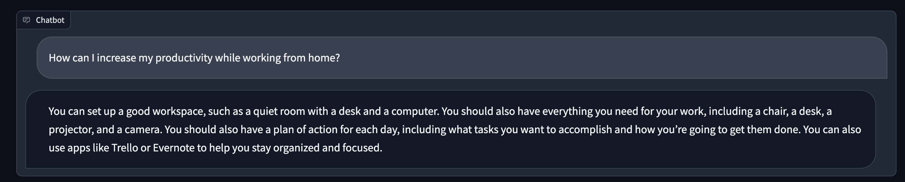
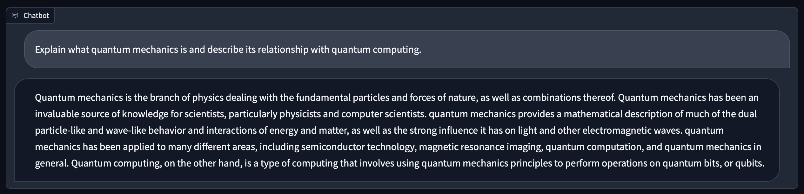
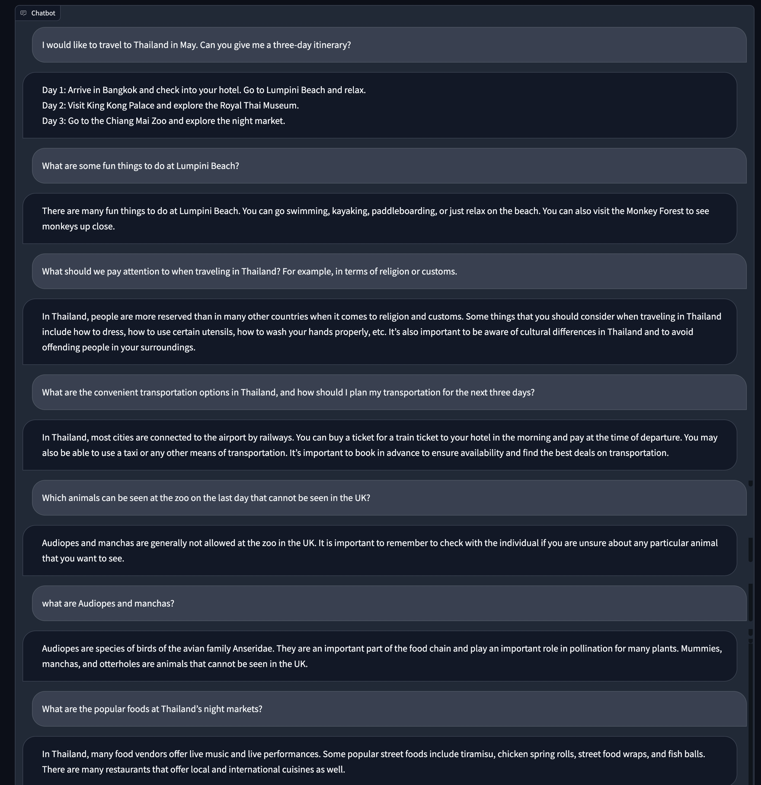
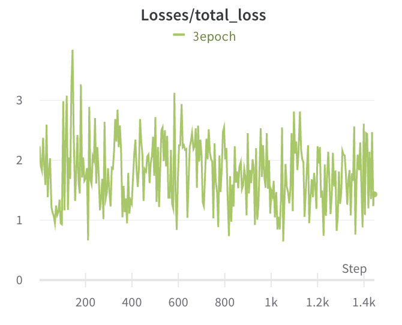

<!--
 * @Author: LiangSong(sl12160010@gmail.com)
 * @Date: 2023-03-10 21:18:35
 * @LastEditors: LiangSong(sl12160010@gmail.com)
 * @LastEditTime: 2023-04-16 23:49:28
 * @FilePath: /Open-Llama/README_en.md
 * @Description: 
 * 
 * Copyright (c) 2023 by LiangSong(sl12160010@gmail.com), All Rights Reserved. 
-->
# Open-Llama

Translated by ChatGPT.

Open-Llama is an open source project that provides a complete set of training processes for building large-scale language models, from data preparation to tokenization, pre-training, instruction tuning, and reinforcement learning techniques such as RLHF.

## Progress

The checkpoint after Instruct-tuning has been open-sourced on [HuggingFace](https://huggingface.co/s-JoL/Open-Llama-V1).
To use the checkpoint, you need to first install the latest version of Transformers using the following command.
``` base
pip install git+https://github.com/s-JoL/transformers.git@dev
```

We completed pre-training on 300 billion tokens, with a total of 80,000 steps trained, using a global batch size of 4 million, consistent with Llama. We constructed the instruction-tuning dataset using a total of 7 parts of data, which the model has certain programming ability, mathematical ability, and multi-turn dialogue ability. For specific data, please refer to the instruction-tuning section.

[Demo](http://home.ustc.edu.cn/~sl9292/)

We tested our model by referring to some tests for Wenxin Yiyuan. Original report can be found at Baidu ["Wenxin Yiyan" Test: What is the level of domestic generative AI?](https://www.8btc.com/article/6809666)

The results of our model are shown in the following figure, and more results are yet to be further tested. Due to domestic network problems, the use of the above Demo may result in a request loss situation. If there is no response for a long time, please refresh and try again.



Here is a demonstration of the model's ability in multi-turn dialogue about code.



We roughly estimate the cost to achieve the above results. The 40K-step pre-training used 150 million pre-training data, which is about 110B tokens. The total training time is 76 hours, and the cost is about $19,152 according to Google Cloud's A100 quotation. The Instruction-tuning training was carried out for 12k steps, using 1.6 million data, and the total training time was 3.4 hours, costing about $342. Therefore, the total cost of training such a model from scratch is less than $20,000.

Currently, the model's performance in both mathematical and code-related tasks is noticeably poor. This is partially due to the training data used, but I also believe it is due to the size of the model. However, the ability to perform logical reasoning is essential for any usable model. Therefore, future updates will focus on improving this aspect of the model's capabilities.
## **Features**
### Ease of Use
We believe that ease of use is one of the most important features when building large-scale language models. To make Open-Llama more accessible, we focus on the following:

- **Minimal implementation**: We use the simplest implementation approach to reduce the barrier to entry and make it easy for beginners to get started.
- **Complete workflow**: We provide complete code from data set construction to training, making each step of building a large language model clear and visible.

### High Performance
Since training large language models is costly, high performance is also crucial when building large-scale language models. To achieve high-performance training, we employ the following techniques:

- **Fused CUDA kernel**: Using fused CUDA kernels provided by [xformers](https://github.com/facebookresearch/xformers) can fuse multiple operations together, reducing data transfer between GPU and CPU, and improving training efficiency.
- **Parallel training**: We use the [Accelerate](https://huggingface.co/docs/accelerate/index) library to support parallel training on multiple GPUs, accelerating the training process.


For 7B mode, the training speed of the Llama model using the PyTorch native version in the Transformers library is 1378 tokens/s/GPU. With our code, the training speed reaches 3290 tokens/s/GPU, which is close to the reported 3370 tokens/s/GPU in the [Llama paper](https://arxiv.org/pdf/2302.13971.pdf).
If we pretrain with 500 billion tokens, it will take 43,000 GPU hours. Assuming the price of A100-80G Spot on Google Cloud is $12.6 per hour for 8 GPUs, the total cost will be $67,725.
Without acceleration, the cost would be $158,744. Our method reduces the training cost by $90,019 in total.
More comparison can be found in [Comparison of Performance with Other Open-Source Models](https://github.com/Bayes-Song/Open-Llama/blob/main/README_en.md#performance-comparison-with-other-open-source-models).
### Universality
When training language models, we aim to build a universal model that can be used for different languages and fields. To achieve this, we adopt the following strategies:

- **Multi-language support**: We support a variety of language corpora, including English, Chinese, Japanese, and other languages, allowing users to choose according to their needs.
- **Field universality**: We hope that the model can not only help with everyday problems but also assist in professional fields such as science and law.
## **Requirements**
- Python 3.7 or higher
- PyTorch 1.13
- Customized [Transformers library](https://github.com/Bayes-Song/transformers)
- [Accelerate library](https://huggingface.co/docs/accelerate/index)
- CUDA 11.6 or higher version (for GPU acceleration, tested based on CUDA 11.7)
## **Getting Started**
### Installation
Use the following command to install the required dependencies:

```bash
pip install -r requirements.txt
```

### Dataset Preparation
Currently, we provide the Wudao dataset from ZhuiyiAI and The Pile dataset from EleutherAI. The code for downloading and processing the datasets can be found in the data directory. Please note that the Wudao dataset requires agreeing to some agreements before downloading, so you may need to modify the link in download_wudao.sh. [WuDao](https://data.baai.ac.cn/details/WuDaoCorporaText)

Use the following commands to download and shard the data:

```bash
bash data/download_the_pile.sh
bash data/download_wudao.sh
```
The data will be stored as small files with a maximum of 16,384 lines per file for efficient multi-processing training. The storage format is jsonl.zst compressed with zstd, resulting in a total data size of 519.5 GB and 16,466 files.

The Pile dataset contains 210,607,728 rows of JSON lines, and the Wudao dataset contains 59,132,213 rows of JSON lines.

The specific data format is as follows:

```
WuDao
{'id': 1, 'dataType': '百科', 'title': 'some title', 'content': 'some content'}

The Pile
{'text': 'some text', 'meta': {'pile_set_name': 'Github'}}
```

Verification of data intergrity can be foud in this [issue]((https://github.com/s-JoL/Open-Llama/issues/5)

### Data Loading
The code for loading data can be found in the dataset directory, which includes training a tokenizer using SentencePiece and constructing a DataLoader based on the tokenizer.

Train the tokenizer with the following command:

```bash
python3 dataset/train_tokenizer.py
```
Check the DataLoader output with the following command:

```bash
python3 dataset/pretrain_dataset.py
```
### Model Structure
We modified the [Llama](https://github.com/facebookresearch/llama) model in the Transformers library based on section 2.4 "Efficient Implementation" in the original paper and introduced some optimizations from other papers. Specifically, we introduced the memory_efficient_attention operation from the [xformers library](https://github.com/facebookresearch/xformers) by META for computing self-attention, which significantly improves performance by about 30%. Please refer to modeling_llama.py for details.

We also referred to Bloom for introducing stable embeddings for better training of token embeddings.

Finally, we referred to PALM and used shared input-output embeddings.

### Pretraining
We use the Accelerate library for multi-GPU parallel training. Launch training with the following command:

```bash
accelerate launch --config_file configs/default_config.yaml pretrain_llama.py
```
In some cases, it may be necessary to specify the following parameters.
```
--main_process_ip
--main_process_port
--num_processes
--num_machines
--machine_rank
```
We use [Wandb](https://wandb.ai/) for training visualization and you need to modify the environment variable WANDB_API_KEY.

We use DeepSpeed stage 1 to reduce GPU memory usage. Accelerate-related configurations can be found in configs/default_config.yaml.

The training-related hyperparameters can be found in configs/train_config.py. We currently train a 7B Llama model with a vocabulary size of 100,000, and the specific configuration is as follows:

| max_length | batch_size | learning_rate | weight_decay | params | dimension | n heads | n layer | vocab_size |
|------------|------------------|---------------|--------------|--------|-----------|---------|---------|------------|
| 1024       | 2                | 2e-4          | 1e-1         | 6.88B  | 4096      | 32      | 32      | 100000     |

```
=========================================================================================================
Layer (type:depth-idx)                                  Output Shape              Param #
=========================================================================================================
LlamaForCausalLM                                        [1, 64, 32, 128]          --
├─LlamaModel: 1-1                                       [1, 64, 32, 128]          --
│    └─Embedding: 2-1                                   [1, 64, 4096]             409,600,000
│    └─LayerNorm: 2-2                                   [1, 64, 4096]             8,192
│    └─ModuleList: 2-3                                  --                        --
│    │    └─LlamaDecoderLayer: x32                      [1, 64, 4096]             202,383,360 x 32
│    └─LlamaRMSNorm: 2-4                                [1, 64, 4096]             4,096
=========================================================================================================
Total params: 6,885,879,808
Trainable params: 6,885,879,808
Non-trainable params: 0
Total mult-adds (G): 6.89
```
Current Progress

### Instruction-Tuning

We performed instruction-tuning on three currently available open-source datasets, and we plan to add more tasks and our own constructed datasets in the future.
- [yizhongw/self_instruct](https://huggingface.co/datasets/yizhongw/self_instruct)
- [BelleGroup/generated_train_0.5M_CN](https://huggingface.co/datasets/BelleGroup/generated_train_0.5M_CN)
- [BelleGroup/generated_train_1M_CN](https://huggingface.co/datasets/BelleGroup/generated_train_1M_CN)
- [BelleGroup/train_0.5M_CN](https://huggingface.co/datasets/BelleGroup/train_0.5M_CN)
- [BelleGroup/train_1M_CN](https://huggingface.co/datasets/BelleGroup/train_1M_CN)
- [BelleGroup/multiturn_chat_0.8M](https://huggingface.co/datasets/BelleGroup/multiturn_chat_0.8M)
- [BelleGroup/school_math_0.25M](https://huggingface.co/datasets/BelleGroup/school_math_0.25M)
- [RyokoAI/ShareGPT52K](https://huggingface.co/datasets/RyokoAI/ShareGPT52K)
- [Graverman/Instruct-to-Code](https://huggingface.co/datasets/Graverman/Instruct-to-Code)
There were some issues with the handling of ShareGPT52K dataset in the processing of the datasets. We downloaded the original data again and reprocessed it.

We did some preprocessing on the raw data, the format is as follows:
```
user: {prompt}\nsystem: {completion}</s>
```
The training code is similar to pre-training and can be seen in
```
instruction_tuning.py
```

The launch command is also similar to pre-training:
```bash
accelerate launch --config_file configs/default_config.yaml instruction_tuning.py
```
In some cases, the following parameters may need to be specified:
```
--main_process_ip
--main_process_port
--num_processes
--num_machines
--machine_rank
```

The loss during the process is as follows, basically fluctuating and not decreasing much:

### RLHF
N/A

### Server

Use server.py for single-turn conversation, and chat_server.py for multi-turn conversation.

Developed based on Gradio.
## Performance Comparison

### Training Framework
In terms of the training framework, we tested the HuggingFace's Accelerate library and HPC-AI's ColossalAI, and found that there was little difference in performance when running on fully utilized GPUs. Therefore, we ultimately chose the relatively simple Accelerate library as our training framework.

The test data is shown below, and the model structure used during testing is:

| Model | n gpu | n layer | n heads | hidden size | vocab size | seq length |
|-------|-------|---------|---------|-------------|------------|------------|
| GPT2  | 2     | 6       | heads   | 4096        | 250100     | 1024       |

The test results are shown below, and we can see that there is little difference in speed and memory utilization when running on fully utilized GPUs:

|                 | HuggingFace                       | HuggingFace                        | ColossalAI                                             | ColossalAI                                             | ColossalAI                         |
|-----------------|-----------------------------------|------------------------------------|--------------------------------------------------------|--------------------------------------------------------|------------------------------------|
| config          | without activation ckpt, bs2      | without activation ckpt, max_bs=12 | with activation ckpt, bs2                              | without activation ckpt, bs2                           | without activation ckpt, max_bs=10 |
| second pre step | 0.336, fw=0.033, bw=0.3, opt=5e-6 | 1.25                               | 0.347                                                  | 0.308, fw=0.067, bw=0.152, opt=0.088                   | 1.055                              |
| gpu memory      | nvidia-smi 45445                  |                                    | fw+bw+opt=21053.63+22064.12+17987.52, nvidia-smi 40961 | fw+bw+opt=24684.74+21087.13+17987.52, nvidia-smi 46821 | oom after 10 steps, suspected memory leak |

### Performance Optimization
In the earliest version, we used DeepSpeed stage2 and the native Llama implementation in Transformers for training. However, the speed was significantly different from what was reported in the paper. Therefore, we conducted a series of optimizations and list the performance improvements for each step below.

The paper mentions that they trained the 6.7B model with 1T tokens, and the GPU utilization was 82432, so the training speed was approximately 3370 tokens/s/GPU. After implementing the following optimizations, our speed is now comparable to that reported in the paper, using 20x8 A100-80G for testing. We expect to achieve better performance by adding more fusion operators in the future.

|                     | V1           | V2                    |
|---------------------|--------------|-----------------------|
| Model               | Transformers | Transformers+xformers |
| Optimizer           | Pytorch Adam | Fused Adam            |
| DeepSpeed           | stage2       | stage1                |
| Grad Accumulation   | 4            | 12                    |
| Return Padding Mask | yes          | no                    |
| Speed token/s/gpu   | 1378         | 3290                  |

### Performance Comparison with Other Open-source Models
The following table summarizes the performance of current open-source models, all tested on A100 GPUs. Due to differences in model sizes and structures, it is difficult to make accurate performance comparisons. As a rough estimate, it can be assumed that speed and model parameter count are inversely proportional, as evidenced by Llama models of different sizes. Based on this rough estimate, it can be seen that the performance using our project is significantly better than other projects.

| Model               | Open-Llama | LLAMA    | LLAMA   | LLAMA     | OPT     | Bloom              | GLM   | GPT-NEOX | CPM-ANT | CodeGeeX  |
|---------------------|------------|----------|---------|-----------|---------|--------------------|-------|----------|---------|-----------|
| Model size          | 6.9B       | 6.7B     | 13B     | 65B       | 175B    | 175B               | 130B  | 20B      | 10B     | 13B       |
| Token               |            | 1T       | 1T      | 1.4T      | 180B    | 366B               | 400B  | 402B     | 200B    | 13.9B     |
| GPU Hour            |            | 82,432   | 135,168 | 1,022,362 | 809,472 | 1,082,990          | 43776 | 175680   | 47040   | 3072      |
| speed token/s/gpu   | 3290       | 3370     | 2055    | 380       | 61.8    | 93.9               | 105.7 | 635.6    | 1181    | 1257      |
| Dependencies        | xformers   | xformers |         |           | measeq  | Megatron-DeepSpeed |       |          | BMtrain | MindSpore |
| speed token/s/gpu/B | 22701      | 22579    | 26715   | 24700     | 10815   | 16432              | 13741 | 12712    | 11810   | 16341     |

## Future Plans
1. Add more training monitoring, such as the distribution of training data categories, and add code for continuing training.
2. Realease the pre-trained checkpoint for the multi-lingual Llama 6.9B model.
3. Implement instruction-tuning code and open-source related checkpoints.
Build an online demo using Gradio.
4. Use [Triton](https://github.com/openai/triton) to add more high-performance operators and further improve performance.
5. Add code for building pre-training datasets based on Common Crawl and open-source related datasets.
6. Add code for multi-modal training.
## Citation
```
@misc{openllama,
  title={Open-Llama},
  author={Liang Song},
  year={2023},
  howpublished={\url{https://github.com/Bayes-Song/Open-Llama}},
}
```
